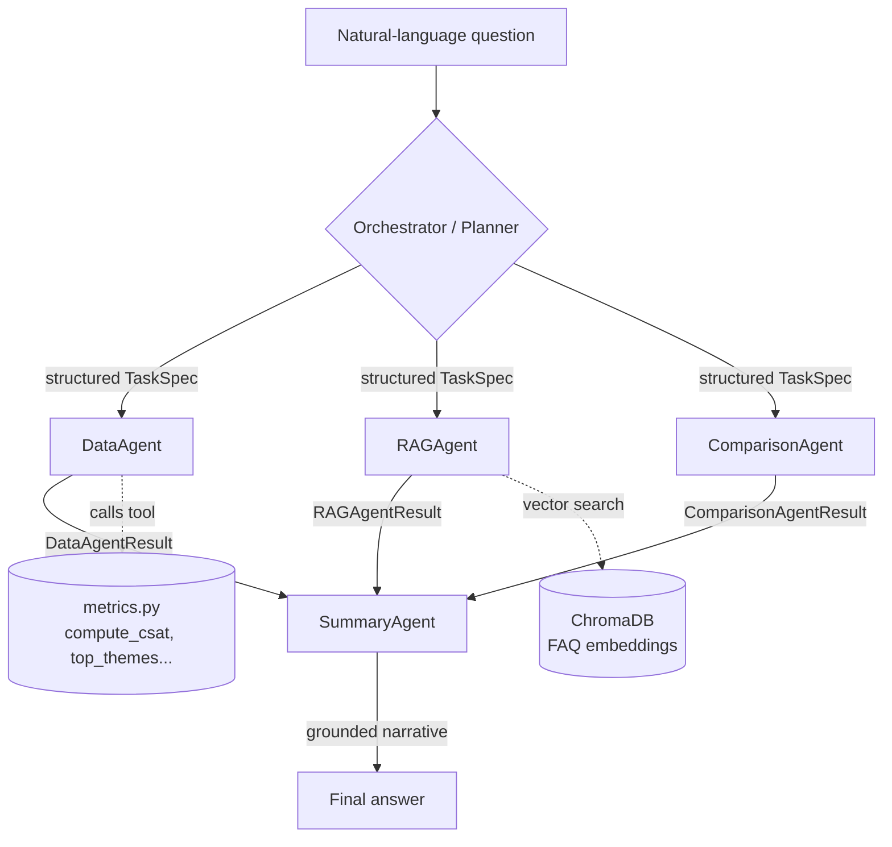

# MiniSense — Survey Analysis Agent

A small, runnable **multi-agent + RAG** system that answers natural-language
business questions about survey feedback. Ask *"What are the top complaints for
GreenLeaf Bistro this month and how do they compare to last month?"* and an
orchestrator plans the work, delegates to specialized sub-agents, computes exact
metrics, retrieves grounding context from a product FAQ, and writes a coherent
business-language answer.

Everything runs **100% locally and free** via [Ollama](https://ollama.com) — no
API key required.

---

## Table of contents
- [What it does](#what-it-does)
- [Architecture](#architecture)
- [Tech stack](#tech-stack)
- [Project structure](#project-structure)
- [Setup & run](#setup--run)
- [API usage](#api-usage)
- [How it works (end to end)](#how-it-works-end-to-end)
- [Design decisions](#design-decisions)
- [Part 2 — RAG evaluation](#part-2--rag-evaluation)
- [Part 3 — Fine-tuning design](#part-3--fine-tuning-design)
- [Observability / logging](#observability--logging)
- [Limitations & future work](#limitations--future-work)

---

## What it does

- **Two-level agent architecture** — an Orchestrator (Planner) that decomposes a
  question and routes it to sub-agents, then synthesizes the final answer.
- **Four sub-agents** — `DataAgent` (exact metrics via tool calling), `RAGAgent`
  (FAQ retrieval), `ComparisonAgent` (period-over-period trends), `SummaryAgent`
  (grounded narrative).
- **Document-grounded RAG** — the product FAQ is chunked, embedded, and searched
  so answers carry real business context.
- **Exact-by-construction metrics** — the LLM decides *what* to compute; real
  Python computes it. No hallucinated numbers.
- **FastAPI `/ask` endpoint**, **Docker Compose** stack, and a full **DEBUG
  trace** of every prompt, tool call, and computed value.

---

## Architecture



**The core principle:** the LLM decides *what to do* (which agents, which
metrics, which search); deterministic Python does *the exact work* (the math, the
comparison). Sub-agents exchange **typed Pydantic objects**, never raw text.

---

## Tech stack

| Layer | Choice | Why |
|---|---|---|
| Language | Python 3.11 | Standard for agent/AI tooling |
| LLM runtime | Ollama (local) | Free, no API key |
| LLM model | `llama3.2:latest` (default) | Fast on CPU (~30–90s/question); `qwen3:8b` for higher quality |
| LLM SDK | `openai` SDK → Ollama's OpenAI-compatible endpoint | Same code works for Ollama **or** real OpenAI |
| Agents | LangGraph | Orchestrator → sub-agent graph |
| Structured I/O | Pydantic v2 | Typed task specs & results (required) |
| Embeddings | `nomic-embed-text` (local via Ollama) | Free, 768-dim |
| Vector store | ChromaDB | Simple local vector DB (cosine) |
| Chunking | Structure-aware + LangChain splitter fallback | Q&A-aware |
| Data | pandas-free pure Python + Faker deps | Metrics + fake data |
| API | FastAPI + uvicorn | `/ask` endpoint |

> **Switching to real OpenAI** is a `.env` change only (`LLM_BACKEND=openai` +
> `OPENAI_API_KEY=...`) — no code changes, because Ollama exposes an
> OpenAI-compatible API and we use the one `openai` SDK for both.

---

## Project structure

```
minisense-survey-analysis-agent/
├── app/
│   ├── main.py             # FastAPI: POST /ask, GET /health
│   ├── orchestrator.py     # Planner + LangGraph graph (plan→route→synthesize)
│   ├── config.py           # .env-driven settings + LLM client factory
│   ├── llm.py              # shared chat() wrapper with prompt/response logging
│   ├── logging_config.py   # structured logger (INFO / DEBUG trace)
│   ├── models.py           # Pydantic contracts (TaskSpec, *Result, AskResponse)
│   ├── agents/
│   │   ├── data_agent.py        # metrics via LLM tool calling
│   │   ├── rag_agent.py         # FAQ retrieval
│   │   ├── comparison_agent.py  # deterministic two-period diff
│   │   └── summary_agent.py     # grounded narrative writer
│   ├── rag/
│   │   ├── embed.py        # text -> vector (nomic-embed-text)
│   │   ├── ingest.py       # chunk + embed + store in Chroma
│   │   └── retrieve.py     # top-k cosine search
│   └── tools/
│       └── metrics.py      # exact metric functions (the "tools")
├── data/
│   ├── generate_data.py    # generate the fake survey dataset
│   └── product_faq.txt     # the FAQ knowledge base (~500 words)
├── docker/entrypoint.sh    # container startup (pull models, build data + index)
├── Dockerfile
├── docker-compose.yml      # Ollama + app, one-command run
├── requirements.txt
└── README.md
```

---

## Setup & run

### Prerequisites
- [Ollama](https://ollama.com) installed and running, with the models pulled:
  ```bash
  ollama pull llama3.2
  ollama pull nomic-embed-text
  ```
- Python 3.11+

### Option A — Local (recommended for development)
```bash
# 1. create + activate a virtual environment
py -3.11 -m venv .venv
.\.venv\Scripts\activate            # Windows
# source .venv/bin/activate         # macOS/Linux

# 2. install dependencies
pip install -r requirements.txt

# 3. configure (defaults are already local Ollama)
copy .env.example .env              # Windows  (cp on macOS/Linux)

# 4. generate the survey dataset (one-time)
python data/generate_data.py        # 60,000 records by default

# 5. build the FAQ vector store (one-time)
python -m app.rag.ingest

# 6. run the API
python -m uvicorn app.main:app --reload
```
Open **http://127.0.0.1:8000/docs** for the interactive Swagger UI.

**Ask a single question from the CLI (no server):**
```bash
python -m app.orchestrator "What is the CSAT for QuickFit Gym in August?"
```

### Option B — Docker (self-contained)
```bash
docker compose up --build
```
This starts Ollama + the app, pulls the models into a volume, generates the data
and vector store, and serves the API at **http://localhost:8000**. First run
downloads models (~2 GB + 270 MB); later runs are fast.

---

## API usage

```bash
curl -X POST http://127.0.0.1:8000/ask \
  -H "Content-Type: application/json" \
  -d '{"question": "What are the top complaints for GreenLeaf Bistro this month vs last month?"}'
```

The response includes the final answer **and** all structured evidence, so a
reviewer can see exactly how it was produced:

```json
{
  "question": "...",
  "answer": "GreenLeaf Bistro's top complaints in August are Wait Time (27.4%)...",
  "data": { "scope": "...", "metrics": { "csat": 60.1, "top_themes": [...] } },
  "rag": { "chunks": [ { "text": "...", "score": 0.80 } ] },
  "comparison": { "csat_change": -9.7, "notable_changes": [...] },
  "plan": [ { "agent": "ComparisonAgent", ... }, ... ]
}
```

Endpoints: `POST /ask`, `GET /health`, `GET /`.

---

## How it works (end to end)

1. **Plan** — the Orchestrator sends the question to the LLM with a `build_plan`
   tool. The model decides which agents are needed, the business, the time scope,
   and whether FAQ context helps. Deterministic guards then resolve the business
   name → id, map "this month" → August 2026, and validate metrics.
2. **Route (LangGraph)** — a compiled graph runs `plan → data → rag → comparison
   → summarize`. Each node acts only if the plan asked for it.
3. **DataAgent** — calls the `get_survey_metrics` **tool**; the LLM chooses the
   metrics, real Python (`tools/metrics.py`) computes exact CSAT / averages /
   themes over the filtered dataset.
4. **RAGAgent** — embeds the query and cosine-searches ChromaDB for the top-k FAQ
   chunks.
5. **ComparisonAgent** — computes July-vs-August metrics deterministically and
   flags notable changes (with exact percentage-point deltas).
6. **SummaryAgent** — receives all the structured evidence and writes one
   grounded paragraph, forbidden from inventing anything not in the evidence.

---

## Design decisions

- **LLM decides, Python computes.** Every number is produced by deterministic
  code, not the model. This is the single most important choice for correctness.
- **Structured hand-offs (Pydantic).** `TaskSpec` down, `*Result` up. No agent
  parses another agent's free text.
- **Tool calling.** `DataAgent` demonstrates an agent invoking a tool
  (`get_survey_metrics`) — the LLM picks the metrics; the tool guarantees the
  math. Robust coercion handles weaker models that send string/JSON-string args.
- **Chunking strategy: structure-aware.** The FAQ is a set of self-contained
  `Q: … A: …` blocks, so we chunk on those boundaries — each chunk answers one
  topic. This beats fixed-size windows, which can split a question from its
  answer or merge unrelated topics. A `RecursiveCharacterTextSplitter` is the
  fallback for unstructured documents. Trade-off: highly precise for clean FAQs,
  but assumes clear block boundaries.
- **Grounding guardrails.** The `SummaryAgent` is given explicit "None" markers
  when no comparison/FAQ was gathered, and is told not to invent or do its own
  arithmetic — this fixed a real hallucination (see git history).
- **Deterministic comparison.** Comparing numbers is arithmetic, so the
  `ComparisonAgent` uses no LLM — eliminating a class of hallucinated deltas.
- **Model default = `llama3.2`.** `qwen3:8b` is more accurate but ~10–18
  min/question on CPU; `llama3.2` brings that to ~30–90s. One-line switch in
  `.env`.

---

## Part 2 — RAG evaluation

Three sample questions run through the full pipeline. For each we show the
retrieved FAQ chunks (top-3, with cosine similarity) and the final answer, then
comment on where retrieval helped and where it fell short.

### Q1. "What are the top 3 complaints for GreenLeaf Bistro this month and how do they compare to last month?"
**Plan:** ComparisonAgent → DataAgent → RAGAgent
**Retrieved chunks:**
| score | chunk |
|---|---|
| 0.749 | "GreenLeaf Bistro — Customer Experience FAQ" (title) |
| 0.683 | "About Us … farm-to-table cafe founded in 2019 …" |
| 0.673 | "Q: How can I share feedback? A: … 1–5 rating …" |

**Answer:** *"The top 3 complaints … are Wait Time, Food Quality, and Staff, with
27.4%, 23.8%, and 17.0% … Wait Time increased by 7.9 percentage points, while
Food Quality and Staff decreased by 1.9 and 2.6 pp."*

**Commentary — retrieval fell short (low harm).** This is a metrics question, so
the correct answer comes from the Data/Comparison agents. Retrieval returned
generic boilerplate (the title and About Us), which added little. Notably the
near-empty **title chunk ranked highest (0.749)** — a chunking weakness. The
answer is still correct because it's driven by exact metrics, not the chunks.

### Q2. "What is GreenLeaf Bistro's CSAT in August and how does it compare to their target?"
**Plan:** ComparisonAgent → DataAgent → RAGAgent
**Retrieved chunks:**
| score | chunk |
|---|---|
| 0.646 | "Q: What is your CSAT target? A: We aim for a CSAT of 4.5 or higher on our 1–5 scale …" |
| 0.70  | title |
| 0.69  | About Us |

**Answer:** *"GreenLeaf Bistro's CSAT in August was 60.1%, which fell 9.7
percentage points from their target of 4.5 or higher. The average rating also
decreased … from 3.85 to 3.55."*

**Commentary — a caught bug, then a fix, with a remaining nuance.** Originally
the planner set `need_faq=false`, so the FAQ target was never retrieved and the
model **misread "target" as last month's CSAT**. We added FAQ-intent hints
(words like "target", "policy", "why") that force retrieval — now the correct
FAQ chunk (the 4.5 target) is retrieved and referenced. **Remaining nuance:** the
FAQ defines its target as *4.5 on the 1–5 scale* (effectively an average-rating
target), while our `csat` metric is *% of ratings ≥ 4*. The model still slightly
conflates the month-over-month delta with the target gap. A future improvement
would reconcile metric definitions and compute an explicit "avg rating vs target"
number.

### Q3. "What does the company say about wait times, and are customers complaining about waiting?"
**Plan:** DataAgent → RAGAgent
**Retrieved chunks:**
| score | chunk |
|---|---|
| 0.804 | "Q: What is your average wait time? A: … under 10 minutes … peak 15–20 min … free drink if wait exceeds 25 min." |
| 0.715 | "Q: How do you handle complaints? A: … escalated to the shift manager within 15 minutes …" |
| 0.636 | "Q: What are your opening hours? …" |

**Answer:** *"The company acknowledges wait times are a concern … 'Wait Time'
accounts for 27.4% of responses. In response, the company opens additional
registers during busy periods and encourages ordering ahead … a free drink is
offered as an apology if the wait exceeds 25 minutes."*

**Commentary — retrieval worked very well.** The top chunk (0.804) is exactly the
wait-time policy, and the answer **fuses the survey metric (27.4% wait-time
complaints) with the FAQ policy** — precisely the intended data + document
grounding. Semantic retrieval also works without keyword overlap (e.g. "phone" →
app-booking chunk in other tests).

### Overall
Retrieval is **strong for specific policy/topic questions** and weak for generic
metrics questions, where it surfaces boilerplate. Two concrete improvements:
(1) merge or down-rank the contentless title chunk; (2) reconcile the FAQ's
rating-scale "CSAT target" with our percentage CSAT metric.

---

## Part 3 — Fine-tuning design

*Scenario: omniSense processes 10,000 responses/day and must classify each
free-text response into one of 8 sentiment+topic categories. GPT-4o is accurate
but too costly to scale. Below is the fine-tuning approach.*

**Data strategy.** Bootstrap labels with the frontier model itself: run GPT-4o on
a stratified sample to produce silver labels, then have humans verify and correct
a subset to create a trusted gold set and a clean held-out test set. For 8
classes I estimate **~800–1,500 labeled examples per class (~8–12k total)** —
enough for a small model to generalize, weighted toward the hardest, most
ambiguous cases surfaced by active learning (low-confidence or disagreement
samples). Curate for class balance, deduplicate near-identical texts, and
stratify across businesses/channels so the model isn't biased to one context.

**Model & technique.** For an 8-way classification task, a fine-tuned **encoder
(e.g. DeBERTa-v3-base)** is the cheapest, fastest, and most robust option and
would be my first choice. If a generative model is preferred for flexibility, a
**1–3B decoder (Llama-3.2-3B) with QLoRA** is the pragmatic pick: QLoRA's 4-bit
quantization lets it train on a single consumer GPU, and LoRA adapters are tiny
and swappable. **Full fine-tuning is unnecessary** here — it costs far more,
risks overfitting a small dataset, and yields little gain over LoRA for a narrow
classification task.

**Training pipeline.** Use the **Hugging Face `Trainer` + PEFT (LoRA/QLoRA)**, or
**Axolotl** for config-driven runs. Version data with DVC and configs in git for
reproducibility. Train with a fixed train/val/test split, class-weighted loss to
handle imbalance, early stopping on validation **macro-F1**, and experiment
tracking (Weights & Biases). Package the job as a containerized step so it runs
identically locally and in CI/CD.

**Evaluation.** Track **macro-F1** (robust to class imbalance) plus per-class
precision/recall and a confusion matrix to catch systematically confused
categories. Benchmark directly against the GPT-4o baseline on the same held-out
set. The model is ready to replace the frontier model when macro-F1 is within
~1–2 points of GPT-4o, no per-class recall falls below an agreed floor, and
latency/cost targets are met — validated with a **shadow deployment** measuring
agreement before cutover.

**Serving.** Serve the LoRA adapter alongside the base model with **vLLM
multi-LoRA**, or expose a dedicated `/classify` microservice. Route only
classification traffic there; existing LLM routes stay untouched. Roll out with a
canary and automatic fallback to GPT-4o on low-confidence predictions.

**Future-proofing.** Keep the pipeline **agnostic to inputs/labels**: define the
category schema in config (not code), abstract the input as "text field → label",
and version the label set. New surveys or new categories then reuse the same
training/serving code with a new config. Monitor for drift and retrain
periodically on freshly labeled data.

---

## Observability / logging

Every endpoint and pipeline stage is logged. Set the level in `.env`:

- `LOG_LEVEL=INFO` — one concise line per step (plan, each agent + timing, total).
- `LOG_LEVEL=DEBUG` — a full **teaching trace**: every prompt sent to the model,
  the tool calls it chooses (with arguments), the exact numbers computed, the
  retrieved chunks with scores, and the evidence bundle handed to the writer.

```
[Planner] ↳ MODEL CALLED TOOL: build_plan({"time_scope":"single","business":"GreenLeaf Bistro",...})
[DataAgent] computed over 6339 rows -> csat=60.1 avg=3.55 themes=[Wait Time 27.4%, ...]
[SummaryAgent] evidence bundle handed to the model: [METRICS] ... [COMPARISON] None ... [FAQ CONTEXT] ...
```

---

## Limitations & future work

- **Local model quality.** `llama3.2` is fast but occasionally sloppy with tool
  arguments (handled by defensive coercion). `qwen3:8b` or a cloud model gives
  higher quality.
- **Rule-based theme mining.** `top_themes` uses keyword matching — transparent
  and free, but a fine-tuned classifier (see Part 3) would be more accurate at
  scale.
- **Structured, not fully autonomous.** The graph runs once with no self-critique
  or re-planning. This is deliberate — it trades autonomy for predictability and
  grounded, verifiable answers.
- **Metric-definition reconciliation.** Align the FAQ's rating-scale target with
  the percentage CSAT metric (see Q2 above).
- **Fixed two-month dataset.** Dates are July–August 2026; real deployment would
  make periods dynamic.
